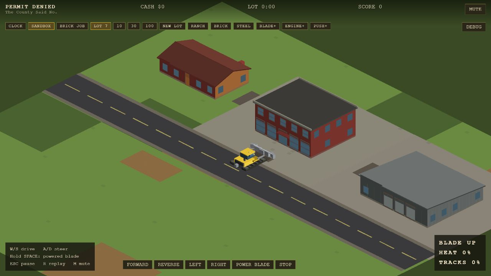
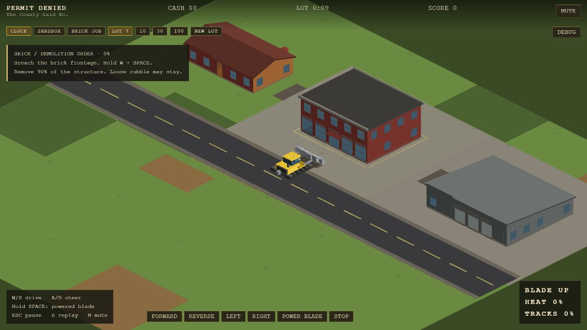
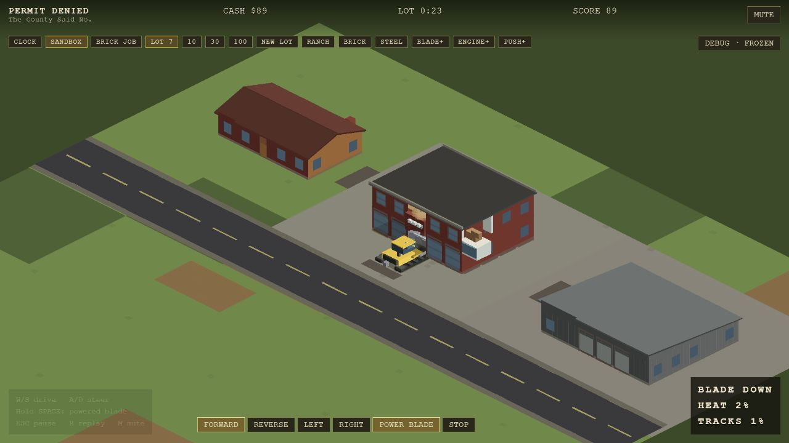
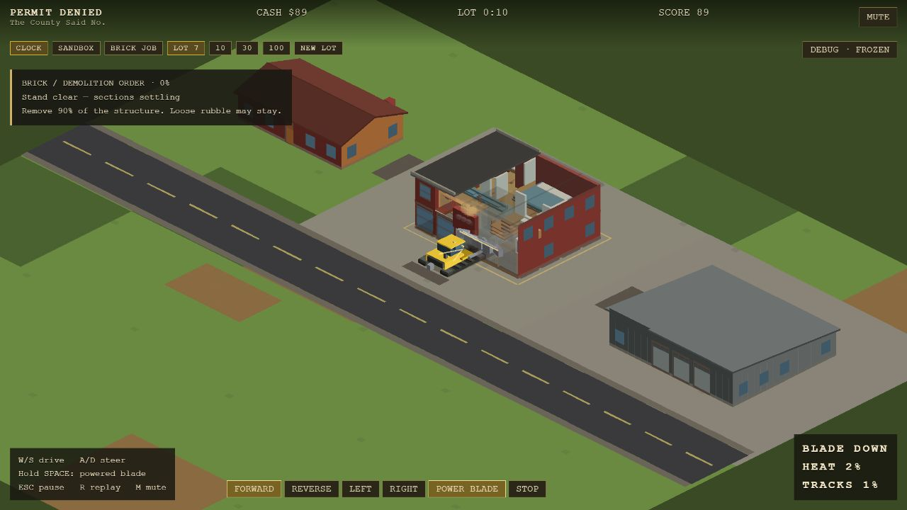
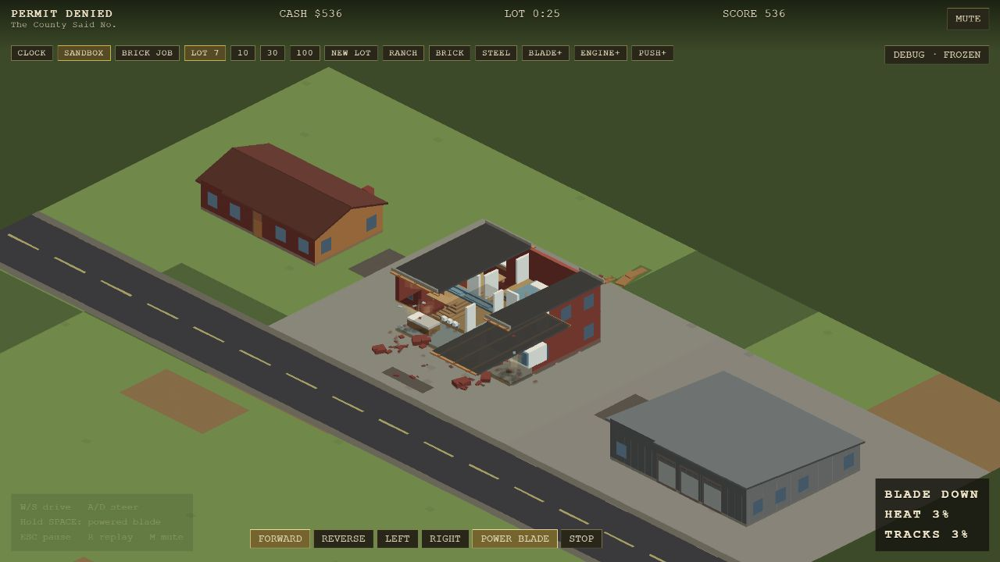
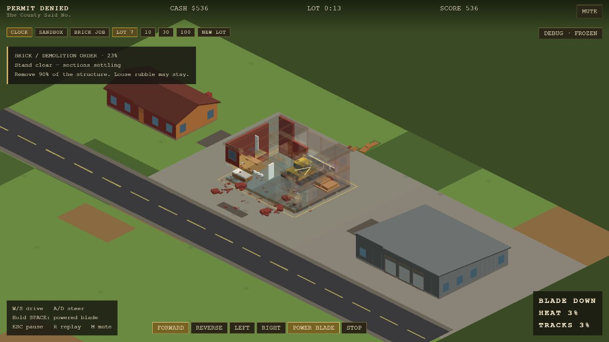
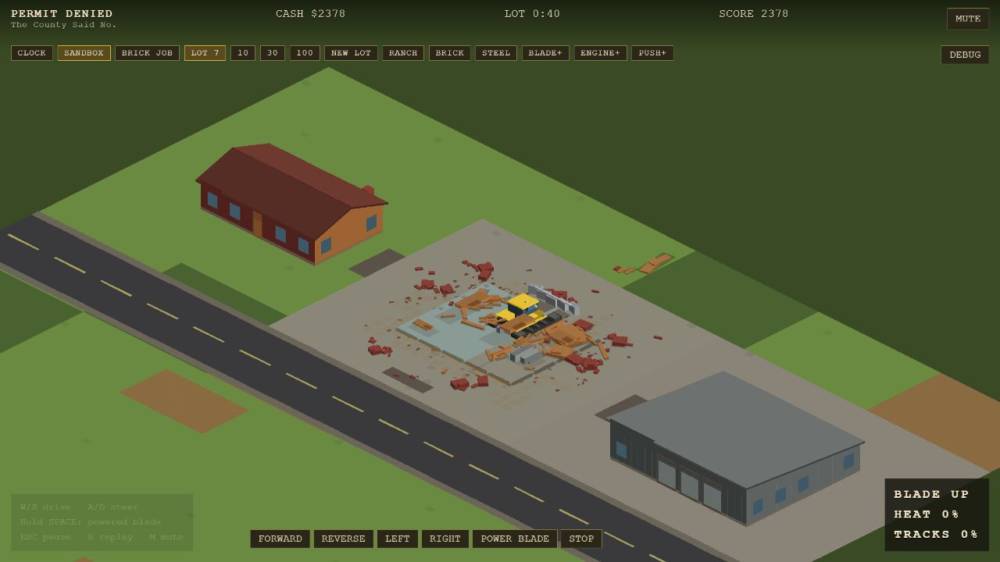
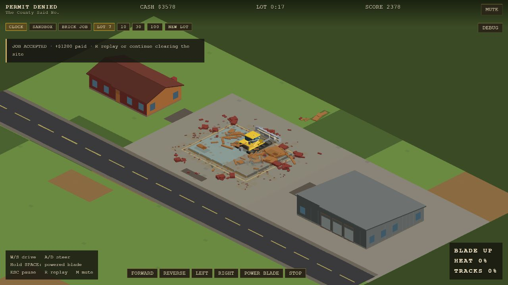
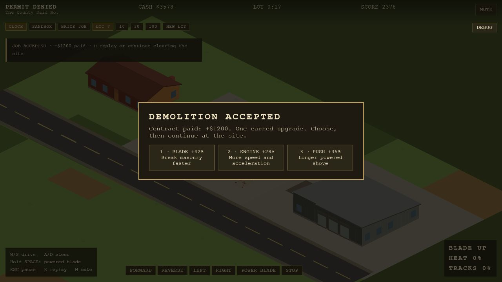

# Brick demolition job

Launch **BRICK JOB** from the toolbar, or open `?job=brick`. Hold W + SPACE to breach the frontage, use A/D to steer and S to reverse. R replays the contract; choosing the earned upgrade resumes at the existing site. CLOCK and SANDBOX start their ordinary sessions. RANCH / BRICK / STEEL presets and free upgrades appear in sandbox.

The introductory contract is untimed and does not fail on heat or track stress. CLOCK retains all three failure conditions. Heat and track readings are separate, with release-blade and back-off-rubble prompts. The introductory straight-line demolition can finish in roughly seven seconds; this is a compact playable slice, not a long mission.

Completion requires at least 90% of the original structural cells to be gone and no actively falling wall/floor or sagging/falling roof sections. Interior voids and loose rubble never enter the denominator. Remaining structural counts and a side hint describe work in progress. The contract pays $1,200 once and grants exactly one upgrade choice. It does not call, claim, or reissue the existing fully-demolished-building bonus. Both rewards remain separately owned. The tested full demolition yielded $2,378 from existing demolition scoring plus the $1,200 contract, for $3,578 cash.

## Rendering decisions

- Camera offsets use scaled screen coordinates, consistent with layout and culling. Inspector and overview remain usable.
- Local projected overlap fades nearby walls, roof bays, upper-floor tiles, partitions and tall contents. Alpha returns smoothly. Ground floors stay solid. A small open heading chevron and blade line assist only while geometry fades; there is no opaque overlaid vehicle.
- Near walls split at cell boundaries for local fading; remote buildings retain merged surfaces. Upper-floor drawing splits into tiles for local ordering and cutaways. Slab thickness is 0.18 world units and exposed edges retain finish contrast.
- A confirmed overlap defect sorted exterior walls at cell centers instead of their visible planes. Walls now sort at their planes; north/west interior walls sort at their thin geometry. This removes a source of apparently floating fixtures without changing support rules.
- Surface statistics accumulate from already-culled, already-extracted surfaces. Interior fixture drawing reuses floor coverage rather than rebuilding its signature for each exposed fixture. Visibility history retains only objects touched in the current frame.

Simulation support rules, collision, demolition damage and persistent debris budgets are unchanged. Existing slab support uses nearby bearing bands; this remains a controlled animation model, not an engineering simulation. Projected bounding boxes are deliberately conservative, so cutaways can reveal a little more than the exact vehicle outline.

## Browser verification

Browser: Codex in-app browser, 1280 × 720, WebGL, default showcase/d100 seeds, ordinary rendering layers and closed inspector in screenshots. An isolated HEAD copy supplied the original simulation/renderer. The current HUD and driving-button adapter were used in that copy for identical test controls; its BRICK JOB button is inert. The baseline screenshot HUD is therefore not a historical UI comparison.

The real-time journey used the driving controls to enter and demolish the building, accept an upgrade, and resume. No teleporting or direct damage was used. A second run used held forward/powered-blade input with the inspector's single-step button to match 60, 120 and 210 simulation frames between renderers. Cash at those checkpoints matched ($89, $211, $536), providing a simulation-state cross-check. The 120-frame pair shows early room exposure; the 210-frame pair shows the vehicle inside during partial collapse. Elapsed HUD times differ because idle setup time is included. Completion shots show settled sites, not identical debris animation timestamps.

| Checkpoint | Before | After |
| --- | --- | --- |
| Approach |  |  |
| First breach, 60 driven frames |  |  |
| Room exposure, 120 frames |  |  |
| Inside / partial collapse, 210 frames |  |  |
| Settled completion |  |  |

Freeze, single-step, roof visibility, district overview and reset were exercised. The optional `&controls=1` adds latched driving buttons for reproducible browser operation through the same Input/stepDozer path. STOP releases all controls. Normal keyboard driving remains the default.

Performance records are in `visual-verification/brick-job/perf-*.json`. Measurements use the same browser tab, viewport, seed and idle spawn, with tests/build stopped. Samples include startup; frame time includes browser scheduling, and GPU time is not measured. The repaired camera changes which objects are visible in d100, so this is a player-view comparison rather than an isolated microbenchmark.

| Scene | Before prep p50 / p90 | After prep p50 / p90 | Before / after frame p50 |
| --- | --- | --- | --- |
| BRICK showcase | 2.5 / 3.9 ms | 2.3 / 3.7 ms | 16.7 / 16.7 ms |
| d100 spawn | 7.2 / 9.5 ms | 2.2 / 3.0 ms | 16.7 / 16.7 ms |

Sample counts: BRICK 840 before / 1,441 after; d100 2,720 before / 2,490 after. The final d100 record is `perf-after-d100-final.json`; the earlier integrated sample is retained separately. These are local observations, not guaranteed frame budgets on other hardware. Both runs reported zero dropped simulation time. The final 1920 × 1080 approach was also inspected; all controls and the vehicle remained in view.

## Final checks

- `node node_modules/vitest/vitest.mjs run`: **204 tests passed across 31 files**, including the long debris-persistence simulation.
- `node node_modules/typescript/bin/tsc --noEmit`: passed.
- `node node_modules/vite/bin/vite.js build`: passed, 772 modules transformed. Vite reports its 500 kB chunk-size advisory for the approximately 512 kB main bundle (165 kB gzip).
- Browser error/warning log: empty in the final preview. `git diff --check`: passed.

The original baseline suite was also run (191 tests / 29 files passed). No commits, pushes or deployments were made. The isolated baseline checkout and server were removed after comparison. Built output remains ignored.
